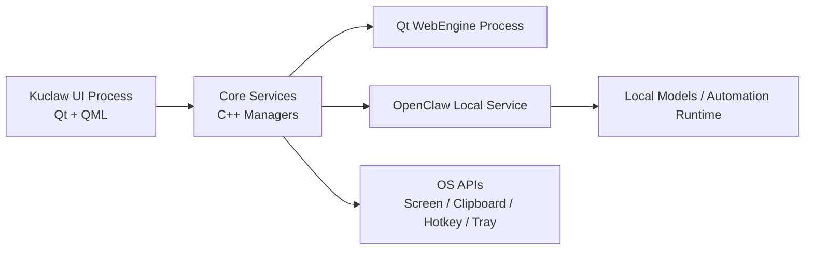

# Kuclaw 现代化桌面软件架构落地指南

## 1. 目标与设计原则

Kuclaw 的目标不是单纯做一个截图工具，而是打造一款兼具截图、贴图、标注、网页工作台与本地 AI 自动化能力的企业级桌面生产力客户端。为了兼顾性能、交互体验、扩展性和跨平台能力，整体架构建议采用如下原则：

- `C++ / Qt` 负责系统级能力、性能敏感逻辑与进程调度。
- `QML` 负责高频交互界面、动画、状态编排和多窗口体验。
- `Qt WebEngine` 负责复杂 Web 内容和在线业务面板的渲染。
- `OpenClaw` 作为本地 AI 服务进程运行，通过标准接口提供模型推理和自动化能力。
- 所有模块都围绕“低耦合、高内聚、可替换、可观测”来设计。

这意味着 Kuclaw 本体应当被视为一个宿主应用，截图贴图是核心原生能力，Web 和 AI 是可插拔的增强能力，而不是把所有逻辑直接堆进 UI 层。

## 2. 总体架构

### 2.1 分层视图

| 模块层级 | 技术 | 职责 |
| --- | --- | --- |
| UI 表现层 | QML + JavaScript | 截图遮罩、选区、工具条、贴图窗口、设置页、AI 面板、嵌入式网页容器 |
| 交互编排层 | Qt C++ 对象暴露给 QML | 负责状态机、命令分发、快捷键事件转发、窗口生命周期管理 |
| 核心能力层 | Qt/C++ | 屏幕捕获、剪贴板解析、图像处理、颜色提取、历史记录、持久化、系统托盘 |
| Web 渲染层 | Qt WebEngine | Chromium 内核渲染、JS Bridge、登录态隔离、网页工作台 |
| AI 引擎层 | OpenClaw Service(Node.js/Python) | 对话、OCR、翻译、任务规划、脚本执行、文件处理 |
| 基础设施层 | CMake + 日志/配置/崩溃收集 | 构建、打包、日志、配置、权限控制、自动更新 |

### 2.2 进程拓扑



推荐采用“单主进程 + 多辅助进程”的模型：

- 主进程：Kuclaw 可执行程序，承载 QML、核心服务和窗口管理。
- WebEngine 子进程：由 Qt WebEngine 自动派生，用于 Chromium 渲染。
- OpenClaw 后台服务：由 Kuclaw 使用 `QProcess` 启动和监管。

这样做的好处是，截图和贴图功能可以保持轻量、稳定，网页崩溃或 AI 服务重启不会直接拖垮整个客户端。

## 3. 模块职责划分

### 3.1 UI 表现层：QML

QML 负责一切用户可见和可交互的界面，包括：

- 全屏截图遮罩层
- 选区框、参考线、尺寸信息、放大镜
- 标注工具条、颜色面板、文字编辑器
- 贴图窗口和其交互状态
- AI 聊天侧栏、任务面板、历史面板
- 内置网页工作台和 Web 页面容器

QML 只做三件事：

- 展示状态
- 收集用户输入
- 触发 ViewModel / Controller 暴露出的命令

不建议把核心业务逻辑写在 QML JavaScript 中。复杂逻辑应沉到 C++，否则会在后期出现状态失控、调试困难和平台差异难以收敛的问题。

### 3.2 核心业务层：C++

这是 Kuclaw 的中枢，建议拆分为若干 Manager：

- `HotkeyManager`
  负责全局快捷键注册、冲突检测、平台适配、事件分发。
- `ScreenCaptureManager`
  负责多屏截图、区域截取、像素采样、截图历史缓存。
- `ClipboardManager`
  负责监控和解析剪贴板内容，识别文本、HTML、颜色值、图像、文件路径。
- `PinWindowManager`
  负责贴图窗口创建、恢复、隐藏、销毁、分组、层级与穿透状态。
- `AnnotationManager`
  负责图层模型、撤销重做、标注渲染数据结构。
- `ColorPickerManager`
  负责取色、格式转换、放大镜所需像素数据。
- `OpenClawServiceManager`
  负责本地 AI 服务进程启动、健康检查、请求转发、异常恢复。
- `WebWorkspaceManager`
  负责 `WebEngineView` 初始化、配置、鉴权、与原生侧通信。
- `SettingsManager`
  负责配置读写、用户偏好、快捷键映射和安全白名单。
- `TelemetryManager`
  负责日志、埋点、性能指标、崩溃前现场记录。

### 3.3 Web 渲染层：Qt WebEngine

`Qt WebEngine` 的定位不是“在应用里塞个网页”，而是承载一类完整的业务工作台：

- 酷家乐等复杂在线页面
- 企业内部运营后台
- AI 配置台、文档面板、流程编排器

建议为 Web 模块建立独立配置边界：

- 单独的 `Profile` 和缓存目录
- 可控的 Cookie / LocalStorage 持久化策略
- 与 QML/C++ 的双向桥接协议
- 针对高性能页面的 GPU、沙箱和调试配置开关

### 3.4 AI 引擎层：OpenClaw

OpenClaw 不直接嵌进主进程，而是作为本地服务运行：

- 便于单独升级模型和推理依赖
- 便于隔离 Python/Node 运行时
- 便于崩溃自动拉起和资源限流
- 便于未来替换为远程 Agent 或混合推理模式

Kuclaw 主程序通过本地 `HTTP/WebSocket` 与 OpenClaw 通信，避免把 AI SDK 直接耦合进桌面 UI 进程。

## 4. 推荐工程结构

```text
kuclaw/
├── CMakeLists.txt
├── apps/
│   └── kuclaw-desktop/
│       ├── main.cpp
│       ├── app/
│       ├── bootstrap/
│       └── resources.qrc
├── src/
│   ├── core/
│   │   ├── hotkey/
│   │   ├── capture/
│   │   ├── clipboard/
│   │   ├── pin/
│   │   ├── annotation/
│   │   ├── color/
│   │   ├── settings/
│   │   └── telemetry/
│   ├── integration/
│   │   ├── openclaw/
│   │   ├── webengine/
│   │   └── platform/
│   ├── domain/
│   │   ├── models/
│   │   ├── commands/
│   │   └── services/
│   └── ui_bridge/
│       ├── viewmodels/
│       ├── adapters/
│       └── qmltypes/
├── qml/
│   ├── app/
│   ├── capture/
│   ├── pin/
│   ├── annotation/
│   ├── ai/
│   ├── web/
│   └── settings/
├── third_party/
├── packaging/
│   ├── macos/
│   └── windows/
└── docs/
    ├── architecture/
    ├── api/
    └── adr/
```

这样划分后，QML、核心服务、第三方集成和领域模型是分开的，后续做单元测试、模块替换和平台裁剪都更容易。

## 5. 关键技术方案

### 5.1 全局快捷键

Qt 原生对全局快捷键支持有限，建议采取“统一接口 + 平台实现”的方式：

- Windows：`RegisterHotKey`
- macOS：`NSEvent` / `CGEventTap`
- 未来 Linux：`X11` 或 Wayland 专项实现

统一暴露成 `IHotkeyRegistrar`，由 `HotkeyManager` 管理注册、注销和冲突提示。主程序通过 `QAbstractNativeEventFilter` 接收事件后，转成 Qt 信号发给上层。

### 5.2 截图与多屏适配

截图核心建议由 C++ 实现，QML 只负责交互层：

- 使用 `QScreen` 枚举屏幕和逻辑坐标
- 使用 `grabWindow(0)` 获取整屏图像
- 建立统一的 `VirtualDesktopGeometry` 坐标系
- 对 Retina / HiDPI 做 devicePixelRatio 映射
- 保留截图历史的缩略图与原图索引

截图状态推荐使用显式状态机：

- `Idle`
- `Selecting`
- `Selected`
- `Annotating`
- `Saving`
- `Pinned`
- `Cancelled`

这样能显著减少快捷键、鼠标事件、工具条状态互相冲突的问题。

### 5.3 放大镜与取色

放大镜不要用 QML 直接放大截图纹理，应由 C++ 生成当前鼠标点周边的像素块数据，再交给 QML 绘制。这样可以：

- 保证取色精度
- 统一不同缩放比下的像素映射
- 避免 QML 层重复做图像裁切

颜色提取建议统一输出：

- `RGB(255, 255, 255)`
- `HEX(#FFFFFF)`
- 可选 `RGBA`
- 可选 0~1 浮点格式

### 5.4 标注系统

标注建议采用“场景图模型 + 命令式撤销栈”：

- 每种标注元素抽象为 `AnnotationItem`
- 线段、箭头、矩形、文本、模糊、高亮都是其子类型
- 对每一次创建、移动、修改、删除都封装为命令对象
- 通过 `QUndoStack` 或自研命令栈实现撤销重做

不要把标注直接画死在位图上。正确方式是：

1. 原始截图位图单独保存
2. 标注图层独立保存
3. 导出时再进行合成

这样可以支持未来的二次编辑。

### 5.5 贴图窗口系统

每张贴图建议对应一个独立窗口实例，但其数据由统一管理器维护：

- `PinWindowModel` 保存内容、变换矩阵、透明度、分组、恢复状态
- `PinWindowController` 控制窗口创建、更新和事件映射
- `PinWindowManager` 管理全局显示隐藏、恢复队列和鼠标穿透切换

核心行为建议建模为：

- `close`
- `destroy`
- `hide`
- `restore`
- `togglePassthrough`
- `resetTransform`
- `toggleThumbnailMode`

这几个行为在产品语义上并不相同，必须在代码层严格区分，否则后期很容易出现“关闭后无法恢复”或“隐藏后被当作销毁”的逻辑混乱。

### 5.6 剪贴板解析

建议定义统一数据结构 `ClipboardPayload`：

```text
type: Image | Text | Html | Color | FileList | Unknown
source: Clipboard | CaptureResult | DragDrop
rawData: QByteArray
meta:
  text
  html
  color
  imageInfo
  filePaths[]
```

贴图动作永远只接收 `ClipboardPayload`，不直接操作系统剪贴板。这样便于未来接入拖放、历史记录和 AI 输出结果复贴。

### 5.7 WebEngine 集成

对于 Web 工作台，建议采用以下策略：

- 每类业务站点使用独立 `QWebEngineProfile`
- 通过 `QWebChannel` 暴露有限的 Native API
- 只允许白名单域名调用原生桥接口
- 下载、文件上传、复制粘贴都走统一授权流程
- 对 DevTools、GPU、远程调试端口保留开发开关

原生桥建议只暴露高层能力，不要暴露任意文件系统访问接口。例如：

- `captureScreen()`
- `readClipboardSummary()`
- `pinImage(data)`
- `invokeAiTask(payload)`

### 5.8 OpenClaw 生命周期管理

建议定义一个后台服务协议：

- 启动：`QProcess` 拉起服务并等待健康检查通过
- 运行：通过 `HTTP` 发起任务，通过 `WebSocket` 收流式结果
- 异常：心跳失败后尝试拉起，达到阈值后提示用户
- 退出：主进程优雅关闭服务，超时后强制结束

可增加以下能力：

- 版本握手
- 模型能力清单拉取
- GPU/内存占用上报
- 工作目录和临时目录白名单

## 6. 跨模块通信设计

### 6.1 QML 与 C++

推荐方式：

- C++ 暴露 `QObject` / `QAbstractListModel` 给 QML
- 所有业务调用通过 `Q_INVOKABLE` 或信号槽完成
- 事件驱动，少用双向引用

例如：

- QML 调 `captureController.beginCapture()`
- C++ 发 `selectionChanged(rect, colorInfo)`
- QML 根据状态更新工具条和放大镜

### 6.2 C++ 与 OpenClaw

推荐协议：

- 同步查询：`HTTP REST`
- 流式任务：`WebSocket`
- 文件传递：仅使用缓存目录中的临时文件或 Base64

推荐请求模型：

```json
{
  "task": "ocr_translate",
  "input": {
    "imagePath": "/safe-cache/job-001/source.png",
    "sourceLang": "auto",
    "targetLang": "zh-CN"
  },
  "context": {
    "origin": "capture_panel",
    "userActionId": "uuid"
  }
}
```

### 6.3 Web 与 Native

建议采用严格桥接协议：

- Web 不直接拿系统权限
- Native 根据域名、页面来源和用户操作上下文做授权
- 对截图、剪贴板、AI 调用这类敏感能力弹出确认或进行白名单控制

## 7. 性能与稳定性设计

### 7.1 性能重点

- 截图遮罩层必须秒开，避免依赖 Web 或 AI 初始化
- 贴图窗口缩放和拖动应尽量走 GPU 合成
- 图像处理尽量放在 C++，避免 QML 层大对象频繁复制
- OpenClaw 初始化放后台，不阻塞主窗口展示
- WebEngine 页面按需加载，不在主界面启动时全部预热

### 7.2 稳定性重点

- 所有系统级接口都需要超时和失败回退
- WebEngine 崩溃需要自动恢复提示
- OpenClaw 服务异常退出要能重启并保留任务错误态
- 关键配置变更要原子写入，防止偏好文件损坏

### 7.3 可观测性

建议至少提供三类日志：

- 应用日志：窗口、快捷键、截图、贴图、AI 请求
- 性能日志：启动耗时、截图耗时、贴图首帧耗时
- 崩溃诊断：未捕获异常、子进程退出码、Web 崩溃原因

## 8. 安全与权限边界

Kuclaw 同时拥有截图、剪贴板、文件访问、网页加载和本地 AI 能力，安全边界必须前置设计：

- OpenClaw 只允许访问缓存目录和用户授权目录
- Web 页面不能直接获取任意本地路径
- 本地桥接接口采用域名白名单和调用白名单
- 贴图与截图缓存目录定期清理
- 敏感日志默认脱敏，不记录剪贴板全文和图片原文
- macOS 权限申请需覆盖屏幕录制、辅助功能等场景

## 9. 推荐开发阶段

### Phase 1：原生核心闭环

目标是先做出稳定的截图和贴图基础能力：

- 托盘 + 全局快捷键
- 全屏截图遮罩
- 选区与放大镜
- 剪贴板贴图
- 贴图窗口基础交互
- 配置持久化

### Phase 2：标注与历史系统

- 标注图层模型
- 撤销重做
- 历史记录回放
- 导出文件和快捷保存
- 已关闭贴图恢复机制

### Phase 3：Web 工作台

- `WebEngineView` 容器
- `QWebChannel` Native Bridge
- 登录态和缓存隔离
- 业务站点白名单

### Phase 4：OpenClaw 集成

- 后台服务拉起与健康检查
- AI 面板与任务流
- OCR / 翻译 / 总结 / 智能命令
- 文件与截图联合处理

### Phase 5：企业级完善

- 自动更新
- 崩溃恢复
- 埋点与诊断
- 权限审计
- 组织级配置分发

## 10. 技术选型建议

建议优先采用以下基线：

- 语言：`C++20`
- 框架：`Qt 6.x`
- 构建：`CMake`
- UI：`QML + Qt Quick`
- Web：`Qt WebEngine`
- 网络：`QNetworkAccessManager + WebSocket`
- 持久化：`QSettings + SQLite`
- 日志：`spdlog` 或 Qt Logging 封装
- 图像处理：先用 Qt 原生能力，重处理再考虑 OpenCV

如果团队规模较小，不建议一开始就引入过重的微服务思维。Kuclaw 首先应是一个强宿主、清边界的桌面应用，然后逐步演进出 AI 服务和 Web 工作台生态。

## 11. 关键风险与规避建议

### 风险 1：QML 逻辑过重

表现为状态混乱、调试困难、性能抖动。

规避方式：复杂状态机、图像处理、窗口调度统一沉到 C++。

### 风险 2：截图与坐标系错误

表现为多屏、缩放比、Retina 下选区偏移。

规避方式：从 Day 1 建立统一虚拟桌面坐标和 devicePixelRatio 转换模型。

### 风险 3：Web 与 Native 权限失控

表现为网页桥接口过大，带来安全风险。

规避方式：桥接 API 最小化、白名单域名、显式授权。

### 风险 4：AI 服务拖慢主程序

表现为启动卡顿、退出残留进程、资源占用飙升。

规避方式：独立进程、异步初始化、健康检查、资源上报、超时销毁。

### 风险 5：贴图行为语义混乱

表现为隐藏、关闭、销毁、恢复逻辑互相污染。

规避方式：在领域模型层明确定义贴图生命周期和状态流转。

## 12. 推荐的首批类与接口

首批建议先落这些核心对象：

- `ApplicationCoordinator`
- `HotkeyManager`
- `CaptureSessionController`
- `ScreenCaptureManager`
- `ClipboardManager`
- `PinWindowManager`
- `SettingsManager`
- `OpenClawServiceManager`
- `WebWorkspaceManager`
- `CaptureViewModel`
- `PinboardViewModel`
- `AiPanelViewModel`

其中 `ApplicationCoordinator` 负责把托盘、快捷键、窗口和后台服务编排起来，避免入口分散。

## 13. 结论

Kuclaw 最适合的架构不是“纯桌面软件”也不是“套壳网页应用”，而是：

- 用 `C++/Qt` 建立系统级能力和性能底盘
- 用 `QML` 提供高响应、强动效的原生交互
- 用 `Qt WebEngine` 承载复杂在线工作台
- 用 `OpenClaw` 提供本地 AI 引擎和自动化能力

这套方案的核心价值在于分工清晰：

- 底层重活归 C++
- 用户体验归 QML
- 网页复杂渲染归 Chromium
- 智能能力归 OpenClaw

如果按这个边界推进，Kuclaw 可以先快速做出稳定的截图贴图闭环，再逐步长成一个真正的桌面级智能生产力平台。
