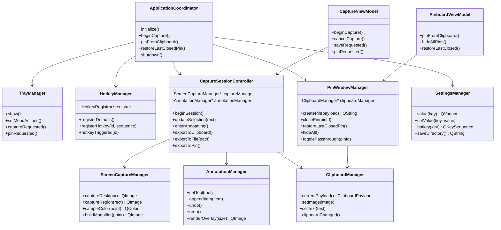
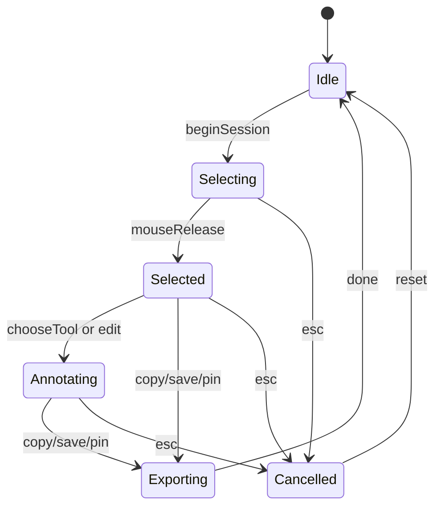
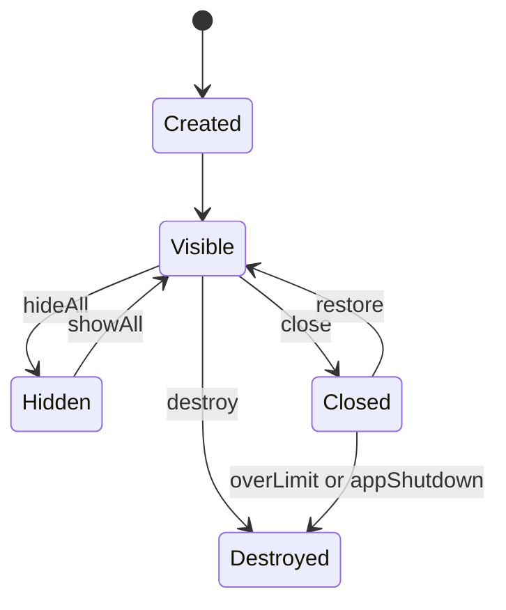

# Kuclaw 首期开发任务拆解 + 类图 + 接口定义

> 配套文档：`Kuclaw现代化桌面软件架构落地指南.md`
>
> 本文聚焦 `Phase 1`，目标是交付一个可稳定使用的桌面原生闭环：`全局快捷键 -> 截图 -> 标注 -> 保存/贴图 -> 贴图窗口管理`。

## 1. 首期范围定义

### 1.1 目标

首期只做最关键的原生能力闭环，不引入 Web 工作台和 OpenClaw 联调，避免首版复杂度失控。

首期交付目标：

- 托盘常驻
- 全局快捷键
- 全屏截图遮罩
- 选区、放大镜、取色
- 基础标注
- 保存到剪贴板
- 保存到文件
- 贴到屏幕
- 贴图窗口管理
- 基础设置持久化

### 1.2 暂不进入首期

- 内置 `Qt WebEngine` 业务工作台
- OpenClaw 本地 AI 服务
- 企业级埋点平台
- 自动更新
- 复杂贴图分组同步
- 二次编辑完整闭环

### 1.3 首期完成标准

满足以下条件即可视为 `MVP Ready`：

- `F1` 可稳定进入截图态，并正确覆盖多屏
- 可拖拽选区并显示尺寸信息
- `W/A/S/D` 与方向键微调可用
- `Alt` 唤出放大镜，`C` 复制颜色值
- 可进行矩形、箭头、文本三类基础标注
- 可保存到剪贴板、文件、贴图窗口
- `F3` 可基于剪贴板内容创建贴图
- 贴图支持移动、缩放、透明度调整、关闭和恢复
- 异常退出不会残留失控窗口

## 2. 里程碑拆解

建议按 6 个里程碑推进，每个里程碑都能形成清晰验收点。

| 里程碑 | 目标 | 产出 |
| --- | --- | --- |
| M0 | 工程初始化 | Qt/CMake 项目骨架、日志、设置、资源组织 |
| M1 | 应用外壳 | 单实例、托盘、主协调器、快捷键框架 |
| M2 | 截图基础 | 多屏捕获、截图遮罩、选区与放大镜 |
| M3 | 标注与导出 | 标注工具、撤销重做、保存到剪贴板/文件 |
| M4 | 贴图系统 | 剪贴板解析、贴图窗口、恢复与隐藏 |
| M5 | 打磨与交付 | 稳定性、权限、打包、自测清单 |

## 3. 首期任务清单

### 3.1 M0 工程初始化

| ID | 任务 | 依赖 | 交付物 | 验收标准 |
| --- | --- | --- | --- | --- |
| T001 | 初始化 Qt + CMake 工程 | 无 | 可运行工程骨架 | macOS/Windows 可编译启动空应用 |
| T002 | 建立目录结构 | T001 | `src/`, `qml/`, `assets/`, `docs/` | 模块边界清晰，无逻辑堆在 `main.cpp` |
| T003 | 日志系统封装 | T001 | `Logger` | 支持 info/warn/error，带模块标签 |
| T004 | 设置系统封装 | T001 | `SettingsManager` | 可读写快捷键、保存目录、贴图偏好 |
| T005 | 资源管理与 QML 注册 | T001 | `resources.qrc`、QML 模块注册 | QML 资源可按模块加载 |

### 3.2 M1 应用外壳

| ID | 任务 | 依赖 | 交付物 | 验收标准 |
| --- | --- | --- | --- | --- |
| T101 | 单实例保护 | T001 | `SingleInstanceGuard` | 重复启动时激活已有实例 |
| T102 | 托盘图标与菜单 | T001 | `TrayManager` | 支持开始截图、贴图、退出 |
| T103 | 全局快捷键接口抽象 | T004 | `IHotkeyRegistrar` | 可注册 `F1` / `F3` 并回调主程序 |
| T104 | 平台热键实现 | T103 | macOS/Windows 实现类 | 两端都能响应全局热键 |
| T105 | 应用协调器 | T102/T103 | `ApplicationCoordinator` | 统一编排托盘、热键、窗口和服务 |

### 3.3 M2 截图基础

| ID | 任务 | 依赖 | 交付物 | 验收标准 |
| --- | --- | --- | --- | --- |
| T201 | 多屏几何采集 | T105 | `VirtualDesktopGeometry` | 支持负坐标和高 DPI |
| T202 | 整屏捕获 | T201 | `ScreenCaptureManager` | 可返回全屏 `QImage` 和屏幕元信息 |
| T203 | 截图会话状态机 | T202 | `CaptureSessionController` | `Idle/Selecting/Selected/Annotating` 状态可靠切换 |
| T204 | 全屏遮罩窗口 | T203 | `CaptureOverlay.qml` | 进入截图后全局遮罩秒开 |
| T205 | 选区交互 | T204 | 拖拽选区、尺寸浮层 | 鼠标拖拽与微调无明显延迟 |
| T206 | 放大镜与取色 | T202/T205 | `ColorPickerManager` | `Alt` 唤出，`C` 复制 RGB/HEX |
| T207 | 截图历史缓存骨架 | T202 | `CaptureHistoryRepository` | 成功截图后可写入最近记录 |

### 3.4 M3 标注与导出

| ID | 任务 | 依赖 | 交付物 | 验收标准 |
| --- | --- | --- | --- | --- |
| T301 | 标注数据模型 | T203 | `AnnotationItem` 系列 | 至少支持矩形、箭头、文本 |
| T302 | 标注渲染层 | T301 | `AnnotationCanvas.qml` | 绘制正确，缩放后不失真 |
| T303 | 命令栈 | T301 | `AnnotationCommandStack` | 支持撤销/重做 |
| T304 | 工具条与颜色面板 | T302 | `CaptureToolbar.qml` | 可切工具、颜色、线宽 |
| T305 | 导出合成器 | T301 | `CaptureExportService` | 原图 + 标注图层合成输出 |
| T306 | 保存到剪贴板 | T305 | `ClipboardManager::setImage` | 导出结果可粘贴到外部应用 |
| T307 | 保存到文件 | T305/T004 | `SaveService` | 支持默认目录和另存为 |
| T308 | 贴到屏幕入口 | T305 | 与 `PinWindowManager` 打通 | 截图结果可直接生成贴图 |

### 3.5 M4 贴图系统

| ID | 任务 | 依赖 | 交付物 | 验收标准 |
| --- | --- | --- | --- | --- |
| T401 | 剪贴板解析模型 | T306 | `ClipboardPayload` | 可识别图像、文本、HTML、颜色、文件路径 |
| T402 | 贴图窗口模型 | T401 | `PinItem` / `PinWindowModel` | 统一管理变换、透明度、恢复状态 |
| T403 | 贴图窗口 QML | T402 | `PinWindow.qml` | 可拖动、缩放、置顶 |
| T404 | 贴图控制器 | T402/T403 | `PinWindowController` | 支持更新窗口状态和交互映射 |
| T405 | 全局贴图管理 | T404 | `PinWindowManager` | 支持关闭、恢复、隐藏全部 |
| T406 | 快捷键贴图入口 | T401/T405 | `F3` 工作流 | 从剪贴板稳定创建贴图 |
| T407 | 透明度与缩放快捷操作 | T403 | 滚轮、`Ctrl + 滚轮` | 行为与产品需求一致 |

### 3.6 M5 打磨与交付

| ID | 任务 | 依赖 | 交付物 | 验收标准 |
| --- | --- | --- | --- | --- |
| T501 | 权限处理 | T202/T103 | macOS 权限引导 | 屏幕录制、辅助功能权限可提示 |
| T502 | 异常恢复 | T105/T405 | 稳定退出流程 | 退出后无遮罩残留、无悬空贴图 |
| T503 | 自测清单 | 全部 | QA Checklist | 常见路径均覆盖 |
| T504 | 打包脚本 | T001 | macOS/Windows 打包脚本 | 可生成安装包或可运行产物 |

## 4. 开发顺序建议

不建议并行把所有模块一起开工。首期最好沿着一条最短业务链推进：

1. `ApplicationCoordinator + HotkeyManager + TrayManager`
2. `ScreenCaptureManager + CaptureSessionController`
3. `CaptureOverlay.qml + 选区交互 + 放大镜`
4. `AnnotationManager + ExportService`
5. `ClipboardManager + PinWindowManager`
6. `设置、权限、打包、自测`

这样做可以保证每周都有能运行的结果，不会陷入“基础设施很多，但产品能力还不可用”的状态。

## 5. 核心领域模型

### 5.1 CaptureSession

```text
CaptureSession
- sessionId: QString
- state: CaptureState
- desktopGeometry: QRect
- sourceImage: QImage
- selectionRect: QRect
- magnifierVisible: bool
- colorSample: QColor
- annotations: QList<AnnotationItem>
- createdAt: QDateTime
```

### 5.2 ClipboardPayload

```text
ClipboardPayload
- type: ClipboardPayloadType
- source: ClipboardSource
- image: QImage
- text: QString
- html: QString
- color: QColor
- filePaths: QStringList
- originalMimeTypes: QStringList
```

### 5.3 PinItem

```text
PinItem
- pinId: QString
- contentType: PinContentType
- image: QImage
- title: QString
- opacity: qreal
- scale: qreal
- rotation: qreal
- isPassthrough: bool
- isHidden: bool
- canRestore: bool
- createdAt: QDateTime
```

## 6. 类图



## 7. 首批接口定义

下面的接口不是最终代码，而是建议作为第一批头文件契约。先把协议定清楚，团队并行开发会轻松很多。

### 7.1 ApplicationCoordinator

```cpp
class ApplicationCoordinator final : public QObject {
    Q_OBJECT

public:
    explicit ApplicationCoordinator(QObject* parent = nullptr);

    void initialize();
    void shutdown();

public slots:
    void beginCapture();
    void pinFromClipboard();
    void hideAllPins();
    void restoreLastClosedPin();

signals:
    void captureStarted();
    void captureFinished();
    void fatalErrorOccurred(const QString& message);
};
```

职责：

- 应用启动初始化
- 托盘、热键、截图、贴图等模块编排
- 应用退出时的资源清理

### 7.2 IHotkeyRegistrar

```cpp
class IHotkeyRegistrar {
public:
    virtual ~IHotkeyRegistrar() = default;

    virtual bool registerHotkey(const QString& id, const QKeySequence& sequence) = 0;
    virtual void unregisterHotkey(const QString& id) = 0;
    virtual void unregisterAll() = 0;
};
```

要求：

- 不在上层暴露平台 API 细节
- `id` 使用业务语义名，比如 `capture.start`、`pin.create`
- 注册失败必须可返回原因给 UI

### 7.3 HotkeyManager

```cpp
class HotkeyManager final : public QObject {
    Q_OBJECT

public:
    explicit HotkeyManager(std::unique_ptr<IHotkeyRegistrar> registrar,
                           QObject* parent = nullptr);

    bool registerDefaults();
    bool registerHotkey(const QString& id, const QKeySequence& sequence);
    void unregisterAll();

signals:
    void hotkeyTriggered(const QString& id);
    void registrationFailed(const QString& id, const QString& reason);
};
```

### 7.4 ScreenCaptureManager

```cpp
struct DesktopScreenInfo {
    QString screenId;
    QRect geometry;
    qreal devicePixelRatio;
};

struct DesktopSnapshot {
    QImage image;
    QRect virtualGeometry;
    QList<DesktopScreenInfo> screens;
};

class ScreenCaptureManager final : public QObject {
    Q_OBJECT

public:
    explicit ScreenCaptureManager(QObject* parent = nullptr);

    DesktopSnapshot captureDesktop() const;
    QImage captureRegion(const QRect& logicalRect) const;
    QColor sampleColor(const QPoint& logicalPoint) const;
    QImage buildMagnifierImage(const QPoint& logicalPoint,
                               int radius,
                               int scaleFactor) const;
};
```

要求：

- 逻辑坐标与物理像素映射统一在这一层处理
- 上层不直接操作 `QScreen`

### 7.5 CaptureSessionController

```cpp
enum class CaptureState {
    Idle,
    Selecting,
    Selected,
    Annotating,
    Exporting,
    Cancelled
};

class CaptureSessionController final : public QObject {
    Q_OBJECT
    Q_PROPERTY(QRect selectionRect READ selectionRect NOTIFY selectionRectChanged)
    Q_PROPERTY(CaptureState state READ state NOTIFY stateChanged)

public:
    explicit CaptureSessionController(ScreenCaptureManager* screenCaptureManager,
                                      ClipboardManager* clipboardManager,
                                      QObject* parent = nullptr);

    QRect selectionRect() const;
    CaptureState state() const;

    Q_INVOKABLE void beginSession();
    Q_INVOKABLE void cancelSession();
    Q_INVOKABLE void updateSelection(const QRect& rect);
    Q_INVOKABLE void nudgeSelection(int dx, int dy);
    Q_INVOKABLE void resizeSelection(int left, int top, int right, int bottom);
    Q_INVOKABLE void enterAnnotating();
    Q_INVOKABLE void copyResultToClipboard();
    Q_INVOKABLE void saveResultToFile(const QString& path);

signals:
    void stateChanged();
    void selectionRectChanged();
    void magnifierUpdated(const QImage& image, const QColor& color);
    void sessionCompleted(const QImage& resultImage);
};
```

### 7.6 ClipboardManager

```cpp
enum class ClipboardPayloadType {
    Unknown,
    Image,
    Text,
    Html,
    Color,
    FileList
};

struct ClipboardPayload {
    ClipboardPayloadType type = ClipboardPayloadType::Unknown;
    QImage image;
    QString text;
    QString html;
    QColor color;
    QStringList filePaths;
    QStringList mimeTypes;
};

class ClipboardManager final : public QObject {
    Q_OBJECT

public:
    explicit ClipboardManager(QObject* parent = nullptr);

    ClipboardPayload currentPayload() const;
    void setImage(const QImage& image);
    void setText(const QString& text);

signals:
    void clipboardChanged(const ClipboardPayload& payload);
};
```

### 7.7 AnnotationManager

```cpp
enum class AnnotationTool {
    None,
    Rectangle,
    Arrow,
    Text
};

class AnnotationItem {
public:
    virtual ~AnnotationItem() = default;
    virtual QRectF boundingRect() const = 0;
};

class AnnotationManager final : public QObject {
    Q_OBJECT
    Q_PROPERTY(AnnotationTool activeTool READ activeTool WRITE setActiveTool NOTIFY activeToolChanged)

public:
    explicit AnnotationManager(QObject* parent = nullptr);

    AnnotationTool activeTool() const;
    void setActiveTool(AnnotationTool tool);

    void appendItem(std::unique_ptr<AnnotationItem> item);
    void undo();
    void redo();
    QImage renderOverlay(const QSize& targetSize) const;

signals:
    void activeToolChanged();
    void itemsChanged();
};
```

### 7.8 PinWindowManager

```cpp
class PinWindowManager final : public QObject {
    Q_OBJECT

public:
    explicit PinWindowManager(ClipboardManager* clipboardManager,
                              QObject* parent = nullptr);

    Q_INVOKABLE QString createPinFromClipboard();
    QString createPin(const ClipboardPayload& payload);
    Q_INVOKABLE void closePin(const QString& pinId);
    Q_INVOKABLE void destroyPin(const QString& pinId);
    Q_INVOKABLE void restoreLastClosedPin();
    Q_INVOKABLE void hideAllPins();
    Q_INVOKABLE void showAllPins();
    Q_INVOKABLE void setPinOpacity(const QString& pinId, qreal opacity);
    Q_INVOKABLE void setPinScale(const QString& pinId, qreal scale);
    Q_INVOKABLE void togglePassthrough(const QString& pinId);

signals:
    void pinCreated(const QString& pinId);
    void pinClosed(const QString& pinId);
    void pinDestroyed(const QString& pinId);
};
```

### 7.9 SettingsManager

```cpp
class SettingsManager final : public QObject {
    Q_OBJECT

public:
    explicit SettingsManager(QObject* parent = nullptr);

    QVariant value(const QString& key,
                   const QVariant& defaultValue = {}) const;
    void setValue(const QString& key, const QVariant& value);

    QKeySequence captureHotkey() const;
    QKeySequence pinHotkey() const;
    QString defaultSaveDirectory() const;
    int closedPinRestoreLimit() const;
};
```

## 8. QML 侧接口建议

QML 不应该直接感知过多 Manager。建议只注入少量 ViewModel 或 Controller：

- `CaptureViewModel`
- `PinboardViewModel`
- `SettingsViewModel`

### 8.1 CaptureViewModel 暴露给 QML 的最低接口

```cpp
class CaptureViewModel final : public QObject {
    Q_OBJECT
    Q_PROPERTY(bool overlayVisible READ overlayVisible NOTIFY overlayVisibleChanged)
    Q_PROPERTY(QRect selectionRect READ selectionRect NOTIFY selectionRectChanged)

public:
    explicit CaptureViewModel(CaptureSessionController* controller,
                              QObject* parent = nullptr);

    bool overlayVisible() const;
    QRect selectionRect() const;

    Q_INVOKABLE void beginCapture();
    Q_INVOKABLE void cancelCapture();
    Q_INVOKABLE void moveSelectionBy(int dx, int dy);
    Q_INVOKABLE void resizeSelectionBy(int left, int top, int right, int bottom);
    Q_INVOKABLE void copy();
    Q_INVOKABLE void save();
    Q_INVOKABLE void pin();

signals:
    void overlayVisibleChanged();
    void selectionRectChanged();
    void toastRequested(const QString& message);
};
```

QML 事件分工建议：

- `CaptureOverlay.qml` 只处理鼠标和键盘输入
- `CaptureToolbar.qml` 只处理工具栏展示
- `Magnifier.qml` 只消费像素图与颜色值

## 9. 状态流转定义

### 9.1 截图状态流



### 9.2 贴图生命周期



## 10. 测试与验收建议

首期至少覆盖下面这些测试面：

- 多屏 + 不同缩放比下的选区是否偏移
- `F1/F3` 在前后台应用切换时是否稳定
- 截图取消时是否残留遮罩
- 颜色复制结果是否符合 RGB/HEX 预期
- 保存到剪贴板后能否粘贴到微信、飞书、浏览器输入框
- 关闭贴图后能否恢复最近一张
- 隐藏全部和关闭单张是否严格区分

## 11. 建议下一步

如果要从文档直接进入研发，最适合的下一步是：

1. 先生成 `Qt + CMake + QML` 工程骨架。
2. 按本文接口创建空类和头文件。
3. 优先打通 `F1 -> 截图遮罩 -> 选区 -> 复制到剪贴板` 这条最短链路。

只要这条链路跑通，后面的标注和贴图都会顺很多。
